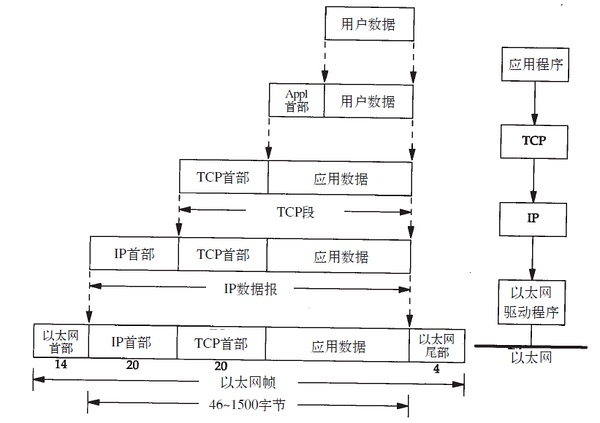
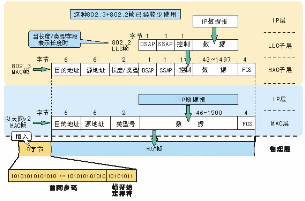
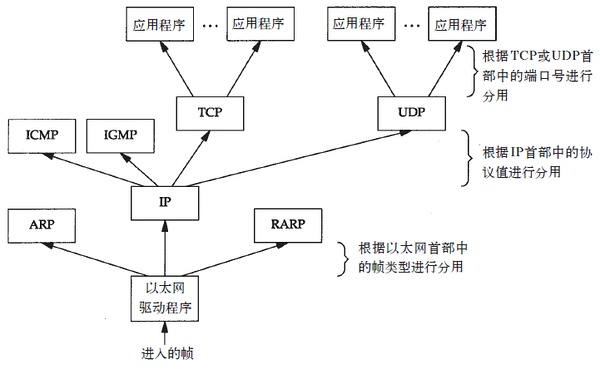
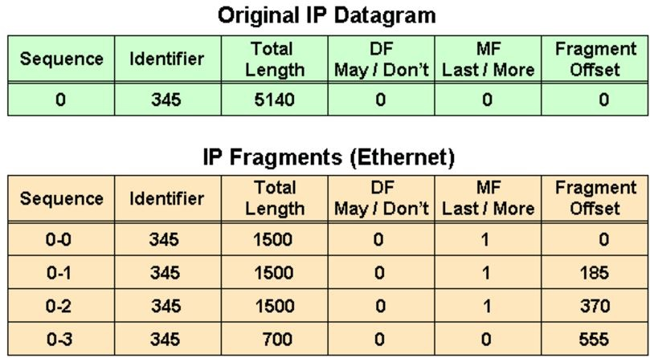
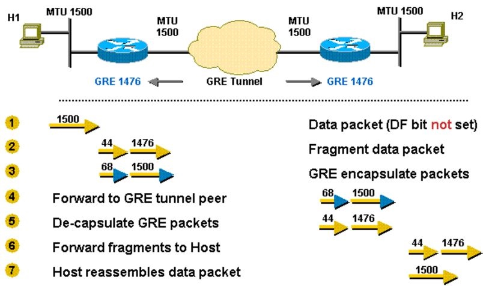
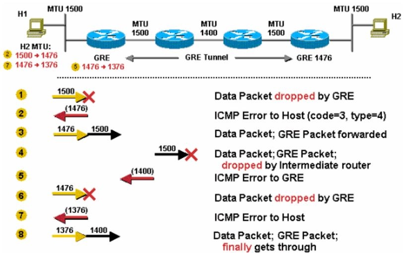
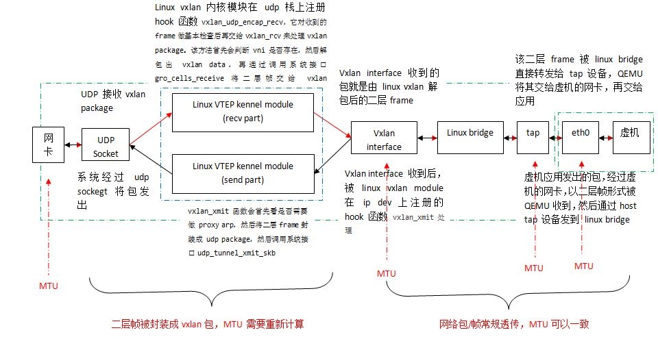

# TCP/IP网络模型

## TCP/IP网络模型

TCP/IP模型是互联网的基础，它是一系列网络协议的总称。这些协议可以划分为四层，分别为链路层、网络层、传输层和应用层。

* 链路层：负责封装和解封装IP报文，发送和接受ARP/RARP报文等。
* 网络层：负责路由以及把分组报文发送给目标网络或主机。
* 传输层：负责对报文进行分组和重组，并以TCP或UDP协议格式封装报文。
* 应用层：负责向用户提供应用程序，比如HTTP、FTP、Telnet、DNS、SMTP等。

在网络体系结构中网络通信的建立必须是在通信双方的对等层进行，不能交错。 在整个数据传输过程中，数据在发送端时经过各层时都要附加上相应层的协议头和协议尾（仅数据链路层需要封装协议尾）部分，也就是要对数据进行协议封装，以标识对应层所用的通信协议。

## OSI七层模型

当然在理论上，还有一个OSI七层模型：物理层、数据链路层、网络层、传输层、会话层、表示层和应用层。这是一个理想模型，由于其复杂性并没有被大家广泛采用。

## 链路层

1 以太网和802封装

以太网封装是以RFC894定义的
而802封装则是RFC1042定义的
主机需求RFC要求：
（1）必须支持以太网封装
（2）应该支持与RFC894混合的RFC1042封装
（3）或许可以发送RFC1042封装的分组

2 SLIP

适用于RS-232和高速调制解调器接入网络
（1）以0xC0结束
（2）对报文中的0xC0和ESC字符进行转义
缺点：没有办法通知本端IP到对端；没有类型字段；没有校验和

3 CSLIP

将SLIP报文中的20字节IP首部和20字节TCP首部压缩为3或5字节

4 PPP协议

修正了SLIP协议的缺陷，支持多种协议类型；带数据校验和；报文首部压缩；双方可以进行IP地址动态协商（使用IP协议）；链路控制协议可以对多个链路选项进行设置。

5 环回接口

用于同一台主机上的程序通过TCP／IP通信。
传给环回的数据均作为输入；
传给该主机IP地址的数据也是送到环回接口；
广播和多播数据先复制一份到环回接口，再送到以太网上。

6 MTU

对数据帧长度的最大限制，如果数据分组长度大于这个数值，需要在IP层对其分片。
注意：发往以太网的数据要考虑路径MTU

## IP网际协议

IP是TCP/IP中最为核心的协议，所有的TCP、UDP、ICMP等协议均以IP数据报的格式传输。IP协议提供不可靠、无连接的服务，它不保证数据报一定可以送达目的，也不保证数据报的先后次序。

IP首部格式为

注：网络字节序：32bit传输的次序为0-7bit, 8-15bit, 16-23bit, 24-31bit（即big endian字节序）

### IP路由

IP路由选择是逐跳进行的。IP并不知道到达任何目的的完整路径（当然，除了那些与主机直接相连的）。所有的IP路由选择只为数据报传输提供下一站路由器的I P地址。它假定下一站路由器比发送数据报的主机更接近目的，而且下一站路由器与该主机是直接相连的。

IP路由选择主要完成以下这些功能：

1) 搜索路由表，寻找能与目的IP地址完全匹配的表目（网络号和主机号都要匹配）。如果找到，则把报文发送给该表目指定的下一站路由器或直接连接的网络接口（取决于标志字段的值）。
2) 搜索路由表，寻找能与目的网络号相匹配的表目。如果找到，则把报文发送给该表目指定的下一站路由器或直接连接的网络接口（取决于标志字段的值）。目的网络上的所有主机都可以通过这个表目来处置。例如，一个以太网上的所有主机都是通过这种表目进行寻径的。这种搜索网络的匹配方法必须考虑可能的子网掩码。关于这一点我们在下一节中进行讨论。
3) 搜索路由表，寻找标为“默认”的表目。如果找到，则把报文发送给该表目指定的下一站路由器。

如果上面这些步骤都没有成功，那么该数据报就不能被传送。如果不能传送的数据报来自本机，那么一般会向生成数据报的应用程序返回一个“主机不可达”或“网络不可达”的错误。

IP路由选择是通过逐跳来实现的。数据报在各站的传输过程中目的IP地址始终不变，但是封装和目的链路层地址在每一站都可以改变。大多数的主机和许多路由器对于非本地网络的数据报都使用默认的下一站路由器。

IP路由选择机制的两个特征：
（1）完整主机地址匹配在网络号匹配之前执行
（2）为网络指定路由，而不必为每个主机指定路由

### IP地址和MAC地址分类

按IP地址范围划分

- A类：地址范围1.0.0.1-126.255.255.255，A类IP地址的子网掩码为255.0.0.0，每个网络支持的最大主机数为256的3次方-2=16777214台。
- B类：地址范围128.0.0.1-191.255.255.255，B类IP地址的子网掩码为255.255.0.0，每个网络支持的最大主机数为256的2次方-2=65534台
- C类：地址范围192.0.1.1-223.255.255.255，C类IP地址的子网掩码为255.255.255.0，每个网络支持的最大主机数为256-2=254台
- D类：以1110开始的地址，多播地址
- E类：以11110开始的地址，保留地址

按照通讯模式划分

- 单播：目标是特定的主机，比如192.168.0.3
- 广播：目标IP地址的主机部分全为1，并且目的MAC地址为FF-FF-FF-FF-FF-FF。比如B类网络172.16.0.0的默认子网掩码为255.255.0.0，广播地址为172.16.255.255。
- 多播：目标为一组主机，IP地址范围为224.0.0.0～239.255.255.255。多播MAC地址以十六进制值01-00-5E打头，余下的6个十六进制位根据IP多播组地址的最后23位转换得到。

单播是对特定的主机进行数据传送。如给某一个主机发送IP数据包，链路层头部是非常具体的目的地址，对于以太网来 说，就是网卡的MAC地址。广播和多播仅应用于UDP，它们对需将报文同时传往多个接收者的应用来说十分重要。

- 广播是针对某一个网络上的所有主机发包，这个网络可能是网络，可能是子网，还可能是所有的子网。如果是网络，例如A类网址的广播就是 netid.255.255.255，如果是子网，则是netid.netid.subnetid.255；如果是所有的子网（B类IP）则是则是 netid.netid.255.255。广播所用的MAC地址FF-FF-FF-FF-FF-FF。网络内所有的主机都会收到这个广播数据，网卡只要把 MAC地址为FF-FF-FF-FF-FF-FF的数据交给内核就可以了。一般说来ARP，或者路由协议RIP应该是以广播的形式播发的。
- 多播就是给一组特定的主机（多播组）发送数据，这样，数据的播发范围会小一些。多播的MAC地址是最高字节的低位为一，例 如01-00-00-00-00-00。多播组的地址是D类IP，规定是224.0.0.0-239.255.255.255。与IP多播相对应的以太网地址范围从0 1 : 0 0 : 5 e : 0 0 : 0 0 : 0 0到01: 00: 5e: 7f: ff: ff。通过将其低位23 bit映射到相应以太网地址中便可实现多播组地址到以太网地址的转换。由于地址映射是不唯一的，因此要其他的协议实现额外的数据报过滤。

## 子网掩码

子网掩码用来确定多少bit用于网络号和多少bit用于主机号。

给定IP地址和子网掩码以后，主机就可以确定IP数据报的目的是：
(1)本子网上的主机；
(2)本网络中其他子网中的主机；
(3)其他网络上的主机。

如果知道本机的IP地址，那么就知道它是否为A类、B类或C类地址(从IP地址的高位可以得知)，也就知道网络号和子网号之间的分界线。而根据子网掩码就可知道子网号与主机号之间的分界线。

### 封装

以太网数据帧的物理特性是其长度必须在46～1500字节之间，而数据帧在进入每一层协议栈的时候均会做一些封装。

而更具体的以太网帧格式为

### 分用

当目的主机收到一个以太网帧时，就在协议栈中从底向上升，同时去掉各层协议加上的报文首部。每层协议盒都要去检查报文首部的协议标识，以确定接收数据的上层协议。这个过程称作分用。

## 分段 (fragmentation)

老的内核通常在IP层处理IP分段，IP层可以接收0~64KB的数据。因此，当数据IP packet大于PMTU时，就必须把数据分成多个IP分段。 较新的内核中，L4会尝试进行分段：L4不会再把超过PMTU的缓冲区直接传给IP层，而是传递一组和PMTU相匹配的缓冲区。这样，IP层只需要给每个分段增加IP报头。但是这并不意味着IP层就不做分段的工作了，一些情况下，IP层还会进行分段操作。

- 分段是指将一个IP包分成多个传输，在接收端 IP 层重新组装
- 一个 IP 包能否分包，取决于它的 DF 标志位：DF bit (0 = "may fragment," 1 = "don't fragment")
- 分包后，每个分段有 MF 标志位：MF bit (0 = "last fragment," 1 = "more fragments")

第一个表格中：

* IP 包长度 5140，包括 5120 bytes 的 payload
* DF = 0， 允许分包
* MF = 0， 这是未分包

第二个表格中：

* 0-0 第一个分包: 长度 1500 = 1480 (payload) + 20 (IP Header). Offset(起始偏移量): 0 
* 0-1 第二个分包: 长度 1500 = 1480 (payload) + 20 (IP Header). Offset: 185 = 1480 / 8 
* 0-2 第三个分包: 长度 1500 = 1480 (payload) + 20 (IP Header). Offset: 370 = 185 + 1480/8
* 0-3 第四个分包: 长度 700 =  680 (payload, = (5140 - 20) - 1480 * 3) + 20 (IP Header) . Offset: 555 = 370 + 1480/8

需要注意的是，只有第一个包带有原始包的完整 IPv4 + TCP/UDP 信息，后续的分包只有 IPv4 信息。

分包带来的问题：

* sender overhead：需要消耗 CPU 去分包，包括计算和数据拷贝。
* receiver overhead：重新组装多个分包。在路由器上组装非常低效率，因此组装往往在接收主机上进行。
* 重发 overhead：一个分包丢失，则整个包需要重传。
* 在多个分包出现顺序错开时，防火墙可能将分到当无效包处理而丢弃。

## MTU

一个网络接口的 MTU 是它一次所能传输的最大数据块的大小。任何超过MTU的数据块都会在传输前分成小的传输单元。MTU 有两个测量层次：网络层和链路层。比如，网络层上标准的因特网 MTU 是 1500 bytes，而在连接层上是 1518 字节。没有特别说的时候，往往指的是网络层的MTU。

要增加一个网络接口 MTU 的常见原因是增加高速因特网的吞吐量。标准因特网 MTU 使用 1500byte是为了和 10M 和 100M 网络后向兼容，但是，在目前1G和 10G网络中远远不够。新式的网络设备可以处理更大的MTU，但是，MTU需要显式设置。这种更大MTU的帧叫做“巨帧”，通常 9000 byte 是比较普遍的。 

相对地，一些可能得需要减少MTU的原因：

* 满足另一个网络的MTU的需要（为了消除UDP分包，以及需要TCP PMTU discover ）
* 满足 ATM cell 的要求
* 在高出错率线路上提高吞吐量
 
MTU 不能和目前任何 Internet 网络协议混在一起，但是，可以使用一个路由器将不同 MTU 的网段连在一起。

## TCP fragmentation

每个TCP数据包（segment）的大小受MSS（TCP_MAXSEG选项）限制。最大报文段长度 ( MSS )表示 TCP 传往另一端的最大块数据的长度。当一个连接建立时（SYN packet）, 连接的双方都要通告各自的MSS。

一般说来,如果没有分段发生, MSS还是越大越好。报文段越大允许每个报文段传送的数据就越多,相对IP和TCP首部有更高的网络利用率。当TCP发送一个SYN时,或者是因为一个本地应用进程想发起一个连接,或者是因为另一端的主机收到了一个连接请求,它能将MSS值设置为外出接口上的MTU长度减去固定的IP首部(20 bytes)和TCP首部长度(20 bytes)。对于一个以太网，MSS值可达1460字节（详细参考tcp_sendmsg）。

TCP/SCTP会将数据按MTU进行切片，然后3层的工作只需要给传递下来的切片加上 ip头就可以了(也就是说调用这个函数的时候,其实4层已经切好片了)。

## Segmentation offload

现在很多网卡本身支持数据分片，这样，上层L4/L3就可以不用进行分片(最大64KB)，而由NIC来完成，从而提高网络性能。

* Large Segment Offload (LSO)：使得网络协议栈能够将超过PMTU的数据包推送至网卡，然后网卡执行分片工作，这样减轻了CPU的负荷
* TCP Segmentation Offload (TSO)：类似于LSO，针对TCP协议包
* UDP Fragmentation Offload (UFO): 类似于TSO，针对UDP包
* Large Receive Offload (LRO): 将接收到的包聚合成一个大的数据包，然后再发给协议栈处理
* Generic Segmentation Offload (GSO): TSO/LSO的增强，同时支持TCP和UDP协议，负责把超过MTU的包分片
* Generic Receive Offload (GRO)：LRO的增强，负责将接收到的多个包聚合成一个大的数据包，然后再发给协议栈处理

## PMTU (Path Maximum Transmission Unit Discovery)

PMTU 的用途是动态的确定从发送端到接收端整个路径上的最小 MTU，从而避免分包。注意，PMTU 只支持 TCP，对其他协议比如 UDP 无效。而且，如果发送方已经开启了 PMTU，那么它发送的所有 TCP/IP 包的 DF 标志都被设置为 1 即不再允许分包。当网络路径上某个路由器发现发送者的包因为超过前面转发路径的 MTU 而无法发送时，它向发送者返回一个 ICMP  "Destination Unreachable" 消息，其中包含了那个 MTU，然后发送者就会在它的路由表中将该mtu值保存下来，再使用较小的 MTU 重新发出新的较小的包。

例子1：超过 MTU，DF = 0 => 路由器分包、发送，接收主机组装

例子2：超过，DF = 1 => PMTU，发送者重新以小包发送

## 参考文档

* [1] <http://www.cnblogs.com/sammyliu/p/5079898.html>
* [2] <http://www.cisco.com/c/en/us/support/docs/ip/generic-routing-encapsulation-gre/25885-pmtud-ipfrag.html>
* [3] <http://blog.csdn.net/opens_tym/article/details/17658569>

