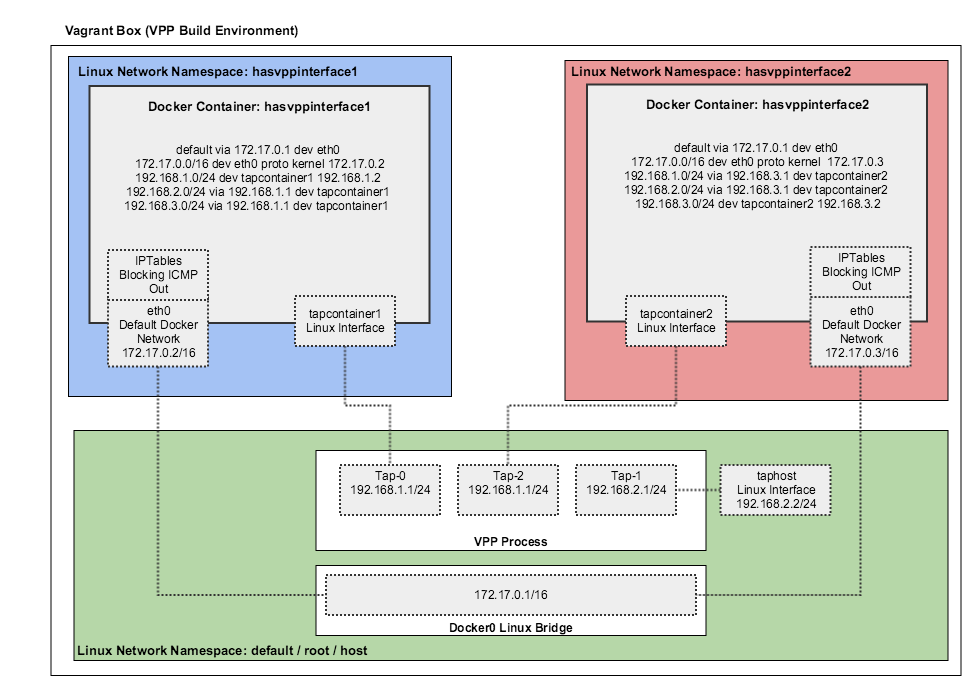

# CNM (Container Network Model)

[Container network model (CNM)](https://github.com/docker/libnetwork/blob/master/docs/design.md)是Docker的网络模型，主要由Sandbox、Network以及Endpoint组成。

- Sandbox：一个Sandbox对应一个容器的网络栈，能够对该容器的interface、route、dns等参数进行管理。一个Sandbox中可以有多个Endpoint，这些Endpoint可以属于不同的Network。Sandbox的实现可以为linux network namespace、FreeBSD Jail或其他类似的机制。
- Endpoint： Sandbox通过Endpoint接入Network，一个Endpoint只能属于一个Network，but may only belong to one Sandbox（这句翻译不好）。Endpoint的实现可以是veth pair、Open vSwitch internal port或者其他类似的设备。
- Network：一个Network由一组Endpoint组成，这些Endpoint彼此间可以直接进行通信，不同的Network间Endpoint的通信彼此隔离。Network的实现可以是linux bridge、Open vSwitch等。

Libnetwork对于CNM的实现包括以下5类对象：

- NetworkController：每创建一个Network对象时，就会相应地生成一个NetworkController对象，NetworkController对象将Network对象的API暴露给用户，以便用户对libnetwork进行调用，然后驱动特定的Driver对象实现Network对象的功能。NetworkController允许用户绑定Network对象所使用的Driver对象。NetworkController对象可以看做是Network对象的分布式SDN控制器。
- Network：Network对象是CNM Network的一种实现。NetworkController对象通过提供API对Network对象进行创建和管理。NetworkController对象需要操作Network对象的时候，Network对象所对应的Driver对象会得到通知。一个Network对象能够包含多个Endpoint对象，一个Network对象中包含的各个Endpoint对象间可以通过Driver完成通信，这种通信支持可以是同一主机的，也可以是跨主机的。不同Network对象中的Endpoint对象间彼此隔离。
- Driver：Driver对象真正实现Network功能（包括通信和管理），它并不直接暴露API给用户。Libnetwork支持多种Driver，其中包括内置的bridge，host，container和overlay，也对remote driver（即第三方，或用户自定义的网络驱动）进行了支持。
- Endpoint：Endpoint对象是CNM Endpoint的一种实现。容器通过Endpoint对象接入Network，并通过Endpoint对象与其它容器进行通信。一个Endpoint对象只能属于一个Network对象，Network对象的API提供了对于Endpoint对象的创建与管理。
- Sandbox：Sandbox对象是CNM Sandbox的一种实现。Sandbox对象代表了一个容器的网络栈，拥有IP地址，MAC地址，routes，DNS等网络资源。一个Sandbox对象中可以有多个Endpoint对象，这些Endpoint对象可以属于不同的Network对象，Endpoint对象使用Sandbox对象中的网络资源与外界进行通信。Sandbox对象的创建发生在Endpoint对象的创建后，（Endpoint对象所属的）Network对象所绑定的Driver对象为该Sandbox对象分配网络资源并返回给libnetwork，然后libnetwork使用特定的机制（如linux netns）去配置Sandbox对象中对应的网络资源。

## Bridge

Bridge是docker默认的网络插件。在不指定network插件时，容器会通过veth pair接到宿主机的docker0网桥上，并通过iptables实现端口映射和外网访问。

## Overlay

Overlay是docker swarm默认的网络插件，基于linux内核vxlan实现跨主机的容器网络通信。

## MACVLAN

MACVLAN可以从一个主机接口虚拟出多个macvtap，且每个macvtap设备都拥有不同的mac地址（对应不同的linux字符设备）。

MACVLAN支持四种模式

- bridge模式：数据可以在同一master设备的子设备之间转发
- vepa模式：VEPA 模式是对 802.1Qbg 标准中的 VEPA 机制的软件实现，MACVTAP 设备简单的将数据转发到master设备中，完成数据汇聚功能，通常需要外部交换机支持 Hairpin 模式才能正常工作
- private模式：Private 模式和 VEPA 模式类似，区别是子 MACVTAP 之间相互隔离
- passthrough模式：内核的 MACVLAN 数据处理逻辑被跳过，硬件决定数据如何处理，从而释放了 Host CPU 资源

使用方法可以参考<https://docs.docker.com/engine/userguide/networking/get-started-macvlan/>。

## IPVLAN

IPVLAN 和 MACVLAN 类似，都是从一个主机接口虚拟出多个虚拟网络接口。一个重要的区别就是所有的虚拟接口都有相同的 mac 地址，而拥有不同的 ip 地址。

IPVLAN支持两种模式：

- L2 模式：此时跟macvlan bridge 模式工作原理很相似，父接口作为交换机来转发子接口的数据。同一个网络的子接口可以通过父接口来转发数据，而如果想发送到其他网络，报文则会通过父接口的路由转发出去。
- L3 模式：此时ipvlan 有点像路由器的功能，它在各个虚拟网络和主机网络之间进行不同网络报文的路由转发工作。只要父接口相同，即使虚拟机/容器不在同一个网络，也可以互相 ping 通对方，因为 ipvlan 会在中间做报文的转发工作。注意 L3 模式下的虚拟接口 不会接收到多播或者广播的报文（这个模式下，所有的网络都会发送给父接口，所有的 ARP 过程或者其他多播报文都是在底层的父接口完成的）。另外外部网络默认情况下是不知道 ipvlan 虚拟出来的网络的，如果不在外部路由器上配置好对应的路由规则，ipvlan 的网络是不能被外部直接访问的。

## OVS

<https://github.com/openvswitch/ovs/blob/master/utilities/ovs-docker>
<http://containertutorials.com/network/ovs_docker.html>

## OVS-DPDK

<https://github.com/clearcontainers/ovsdpdk>

## [OVN](../../ovs/ovn-docker.html)

OVS官方是实现了一个OVN的CNM插件，可以方便的通过overlay或者underlay（需要配合OpenStack Neutron）来给容器配置网络。具体使用可以参考[这里](../../ovs/ovn-docker.html)。

## [Calico](../calico/index.html)

[Calico](https://www.projectcalico.org/) 是一个基于BGP的纯三层的数据中心网络方案（不需要Overlay），并且与OpenStack、Kubernetes、AWS、GCE等IaaS和容器平台都有良好的集成。

Calico在每一个计算节点利用Linux Kernel实现了一个高效的vRouter来负责数据转发，而每个vRouter通过BGP协议负责把自己上运行的workload的路由信息像整个Calico网络内传播——小规模部署可以直接互联，大规模下可通过指定的BGP route reflector来完成。 这样保证最终所有的workload之间的数据流量都是通过IP路由的方式完成互联的。Calico节点组网可以直接利用数据中心的网络结构（无论是L2或者L3），不需要额外的NAT，隧道或者Overlay Network。

此外，Calico基于iptables还提供了丰富而灵活的网络Policy，保证通过各个节点上的ACLs来提供Workload的多租户隔离、安全组以及其他可达性限制等功能。

## [Contiv](../contiv/index.html)

[Contiv](http://contiv.github.io)是思科开源的容器网络方案，主要提供基于Policy的网络管理，并与主流容器编排系统集成。Contiv最主要的优势是直接提供了多租户网络，并支持L2(VLAN), L3(BGP), Overlay (VXLAN)以及思科自家的ACI。

## [Romana](../romana/index.html)

Romana是Panic Networks在2016年提出的开源项目，旨在借鉴 route aggregation的思路来解决Overlay方案给网络带来的开销。

目前，Romana的docker plugin还在开发中。

## VPP

Intel clear container团队针对docker与clear container的集成开发了一个[FD.io](https://fd.io/) [VPP （Vector Packet Processing）](https://wiki.fd.io/view/VPP)插件。

具体使用方法见<https://github.com/clearcontainers/vpp>。

## [SR-IOV](../sriov/index.html)

SR-IOV 技术是一种基于硬件的虚拟化解决方案，允许在虚拟机之间高效共享 PCIe设备，并获得能够与本机性能媲美的 I/O 性能。

